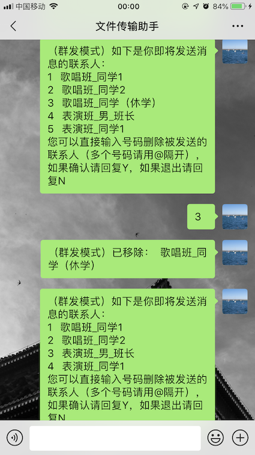
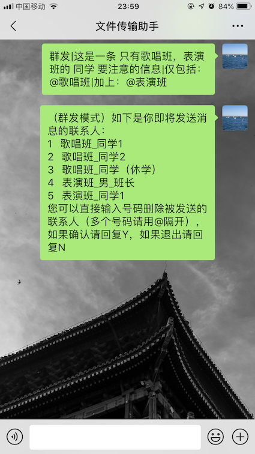

# 微信小助手
# 功能
1. 微信值守
看管微信，自动回复并将没看过的消息发送到指定邮箱。
2. 群发功能
快速可筛选联系人并群发，不需要再通过群发助手。

# 使用指导
## 微信值守
1. 请正确配置如下文件（如不正确配置，邮箱收不到未读信息）：
    1. `Config/sender`: 发送消息的邮箱
    2. `Config/password`: 发送消息的邮箱的密码
    4. `Config/smtp`: 发送消息的邮箱`smtp`配置
    3. `Config/receiver`: 接收消息的邮箱（可以和发送邮箱相同）
2. 运行并扫描二维码后开始自动回复

## 群发
1. 运行并扫描二维码
2. 打开`文件传输助手`输入指令根据如下语义开启群发助手 
    `群发|要群发的消息|限定语句` 
    * 限定语句包括: 
        * `去除：`:从总列表中去除包含特定字符的联系人,如果有多个特定字符使用`@`分开 
        * `仅包括：`:从总（或执行过`去除`操作的）列表中筛选出 仅包括包含特定字符的联系人,如果有多个特定字符使用`@`分开 
        * `加上：`从总联系人列表中找到包含特定字符的联系人并加入到（执行过`去除`或者`仅包括`操作的）群发列表中,如果有多个特定字符使用`@`分开 
    * Example: 
        - 释例1 
            * 发送案例 
            群发消息，`这是一条给所有人的消息` 
            * 发送 
            `群发|这是一条给所有人的消息` 
        - 释例2 
            * 发送案例 
                群发消息的消息，`这是一条 歌唱班，表演班！以外！的 人 和 ！所有辅导员（包括表演班辅导员、歌唱班辅导员）！ 要注意的信息`, 
                去除所有联系人列表中包含`歌唱班`或`表演班`的联系人, 
                再从所有联系人列表中找到包含`辅导员`的联系人加入到结果列表中。 
            * 发送 
            `群发|这是一条 歌唱班，表演班！以外！的 人 和 ！所有辅导员（包括表演班辅导员、歌唱班辅导员）！ 要注意的信息|去除：@表演班@歌唱班|加上：@辅导员` 
        - 释例3
             * 发送案例 
                 群发消息的消息，`这是一条 ！只有！歌唱班，表演班的 人 要注意的信息`, 
                 去除所有联系人列表中包含`歌唱班`或`表演班`的联系人, 
                 再从所有联系人列表中找到包含`辅导员`的联系人加入到结果列表中。 
             * 发送 
             `群发|这是一条 ！只有！歌唱班，表演班的 人 要注意的信息|仅包括：@歌唱班|加上：@表演班` 
         - 释例4 
             * 发送案例 
                 群发消息的消息，`这是一条 ！除！歌唱班，表演班的 ！男班长！ 和 ！所有辅导员！ 要注意的信息`, 
                 去除所有联系人列表中包含`歌唱班`或`表演班`的联系人, 
                 在剩余联系人中筛选出同时只包括`班长`和`男`的联系人， 
                 再从所有联系人列表中找到包含`辅导员`的联系人加入到结果列表中。 
             * 发送 
             `群发|这是一条 ！除！歌唱班，表演班的 ！男班长！ 和 ！所有辅导员！ 要注意的信息|去除：@歌唱班@表演班|仅包括：@班长@男|加上：辅导员` 
         
3. 群助手发送回即群发联系人列表，回复数字删去对应联系人直到确认群发人员，回复Y群发消息，回复N退出群发模式 
    
    
    
    
